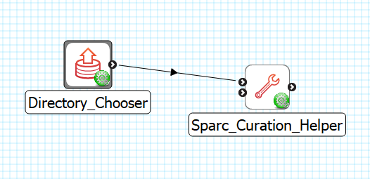
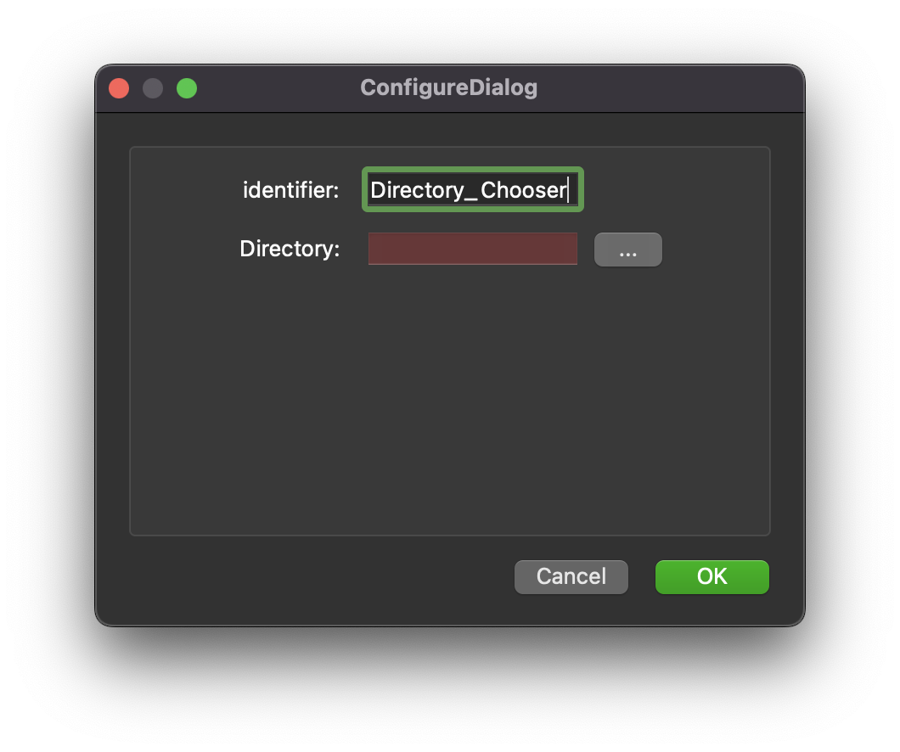

Directory Chooser
=================

Overview
--------
The **Directory Chooser** is MAP Client plugin for choosing a directory from a location outside the workflow.

Workflow Connections
--------------------

As shown in :numref:`fig-mcp-directory-chooser-workflow-connections`, the **Directory Chooser** does not need any input.

It produces 1 output which may be piped to other workflow steps:

1. A location where the directory is on the local disk. (Port: *http://physiomeproject.org/workflow/1.0/rdf-schema#directory_location*) 

.. _fig-mcp-directory-chooser-workflow-connections:

   **Directory Chooser** workflow connections.

Configure
---------

This step is used for choosing a directory on the local disk from outside the workflow directory.
This step provides a *http://physiomeproject.org/workflow/1.0/rdf-schema#directory_location* to define the location where the directory is on the local disk.
To choose the directory use the *...* button to open a directory chooser dialog.
The *Directory* input is used to hold the relative path from the workflow to the input directory location.

.. _fig-mcp-directory-chooser-configure-dialog:

   *Directory Chooser* step configuration dialog.
